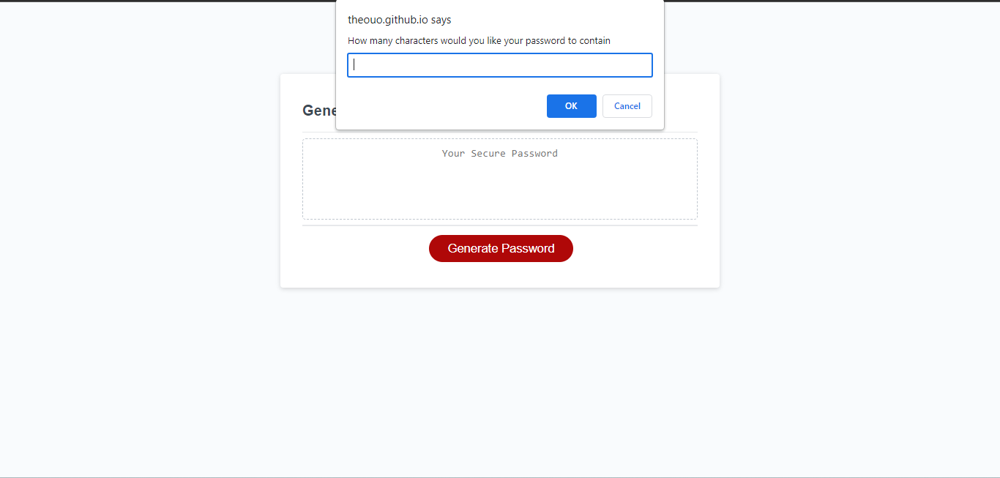

# Password-Generator


## Technology Used 

| Technology Used         | Resource URL           | 
| ------------- |:-------------:| 
| HTML    | [https://developer.mozilla.org/en-US/docs/Web/HTML](https://developer.mozilla.org/en-US/docs/Web/HTML) | 
| CSS     | [https://developer.mozilla.org/en-US/docs/Web/CSS](https://developer.mozilla.org/en-US/docs/Web/CSS)      |   
| Git | [https://git-scm.com/](https://git-scm.com/)     |    

## Description 

[Visit the Deployed Site](https://theouo.github.io/Password-Generator/)

For this project, I create a randomized password generator that allows the user to retrieve a variety of passwords which include numbers, letters, and special characters.


## Usage 

This site is quite easy to navigate through. First select "Generate Password", then an alert pops up whereby you will be asked a series of question before you are provided a randomized password.

```md

```


## Learning Points 

I feel much more confident with the use of functions and loops as working on this project helped to fine-tune my ability in them. I have a better understanding on Javascript methods and their uses!


## Author Info
Theodore Okeke

```md


The user has looked through your whole README, and gotten familiar with your application. 
This is where you take credit, and make it easy for them to learn more about you!
Direct them to the following:
- Your GitHub Profile
- Your LinkedIn
- Your Portfolio Website
- And Anything Else You Want!

Give credit where credit is due! 

If you Pseudocode or Pair Program with someone else, give them kudos in your Contributors section!


## License

MIT License

Copyright (c) [2023] [Theodore Okeke]

Permission is hereby granted, free of charge, to any person obtaining a copy
of this software and associated documentation files (the "Software"), to deal
in the Software without restriction, including without limitation the rights
to use, copy, modify, merge, publish, distribute, sublicense, and/or sell
copies of the Software, and to permit persons to whom the Software is
furnished to do so, subject to the following conditions:

The above copyright notice and this permission notice shall be included in all
copies or substantial portions of the Software.

THE SOFTWARE IS PROVIDED "AS IS", WITHOUT WARRANTY OF ANY KIND, EXPRESS OR
IMPLIED, INCLUDING BUT NOT LIMITED TO THE WARRANTIES OF MERCHANTABILITY,
FITNESS FOR A PARTICULAR PURPOSE AND NONINFRINGEMENT. IN NO EVENT SHALL THE
AUTHORS OR COPYRIGHT HOLDERS BE LIABLE FOR ANY CLAIM, DAMAGES OR OTHER
LIABILITY, WHETHER IN AN ACTION OF CONTRACT, TORT OR OTHERWISE, ARISING FROM,
OUT OF OR IN CONNECTION WITH THE SOFTWARE OR THE USE OR OTHER DEALINGS IN THE
SOFTWARE.


